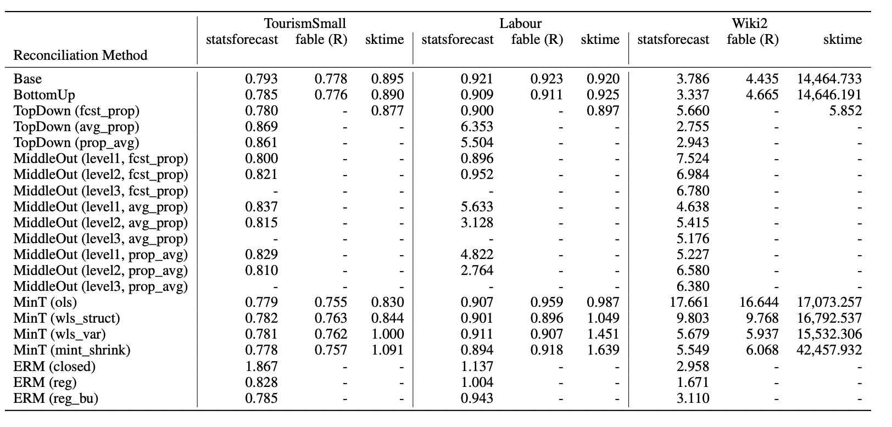

# Hierarchical Methods Comparison

This experiment aims to empirically validate the results presented in other great implementations of hierarchical reconciliation methods for Python and R. We use the ETS model in the following datasets, highly inspired by [Rob Hyndman and George Athanasopoulos's work](https://otexts.com/fpp3/hierarchical.html). 

## Main results

To perform the experiments, we used the TourismSmall, Labour, and Wiki2 datasets, widely used for hierarchical reconciliation research. For TourismSmall and Labour, we used the last eight observations as a test and the last 12 observations for Wiki2.

### Performance (RMSSE)

Notes:
- [fable](https://github.com/tidyverts/fable) also contains `TopDown` and `MiddleOut` methods, but they rise an error. A [Pull Request](https://github.com/tidyverts/fabletools/pull/362) was opened to fix the issue.
- The `RMSSE` (root mean squared scaled error) was calculated against a naive model.

### Time (seconds)

| Dataset      |   statsforecast |   fable |   sktime |
|:-------------|----------------:|--------:|---------:|
| Labour       |           1.982 |  11.233 |   44.368  |
| TourismSmall |           0.627 |   7.61  |   19.120 |
| Wiki2        |           1.822 |  47.626 |  119.941 |

Notes:
- Fitting time for base forecasts.

## Reproducibility

To reproduce the main results you have:

1. Execute `conda env create -f environment.yml`. 
2. Activate the environment using `conda activate hts-comparison`.
3. Run the experiments using `python -m src.[lib] --group [group]` where `[lib]` can be `statsforecast` or `sktime`, and `[group]` can be `Labour`, `Wiki2`, and `TourismSmall`.
4. To run R experiments you have to prepare the data using `python -m src.data --group [group]` for each `[group]`. Once it is done, just run `Rscript src/fable.R [group]`.
5. To parse the results, use `nbs/parse-results.ipynb`.

The results were obtained using a `c5d.24xlarge` AWS instance.

## ToDo

- Run comparisons using the `auto_arima` model.
- Use same base forecasts (obtained with the same library/implementation) with different implementations of the reconciled methods.
- Include `Traffic` Dataset

